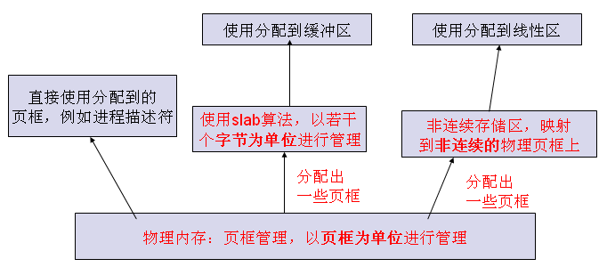

# 内存管理

## 1，Overview

RAM的某些部分永久地分配给内核，用以存放内核代码以及静态数据

RAM的其余部分称为动态存储器（dynamic memory）

进程和内核都需要动态存储器

整个系统的性能取决于如何有效地管理动态存储器，原则：**按需分配，不需要时释放**

## 2，页框管理

Linux内存管理的基本单位：页

Linux采用的标准的页框大小：**4KB**（4KB是大多数磁盘块大小的倍数。传输效率高，管理方便）

### 2.1 页框管理工作

**内核必须记录每个页框的当前状态**

- 哪些属于进程，哪些存放了内核代码/数据
- 对于动态存储器中的页框：是否空闲，即是否可用
- 如果一个页框不可用，内核需要知道是谁在用这个页框
（用户态进程、动态分配的内核数据结构、静态的内核代码、页面cache、设备驱动程序缓冲的数据等等）

**内核使用页描述符来跟踪管理物理内存**

- 每个物理页框都用一个**页描述符**表示
- 页描述符用**struct page**的结构描述(mm_types.h)
- 所有物理页框的描述符，组织在mem_map的数组中

由于每个struct page结构小于64个字节,页描述符将会占用很大的一段空间

### 2.2 node

物理内存被划分为若干个node. 存取时间不等,考虑CPU局部性

Node使用数据结构pg_data_t描述

每个node被划分成若干个zone

**存储区(Memory Zones)**

划分原因：

一些页框由于自身的物理地址的原因不能被一些任务所使用，例如

- ISA总线的DMA控制器只能对ram的前16M寻址
- 在一些具有大容量ram的32位计算机中，CPU不能直接访问所有的物理存储器，因为线性地址空间不够

为了应付这种限制，Linux把具有同样性质的物理内存划分成——区(zones)

每个zone使用**struct zone**表示

**Linux把物理存储器划分为4个区**

- ZONE_DMA：包含存储器的“常规”页，通过把它们映射到线性地址空间的3GB以上，内核就可直接访问
- ZONE_DMA32  (未见用）
- ZONE_NORMAL：包含存储器的“常规”页，通过把它们映射到线性地址空间的3GB以上，内核就可直接访问
- ZONE_HIGHMEM：中包含的存储器页面不能由内核直接访问

### 2.3 请求页框接口

- 分配：
alloc_pages/alloc_page/alloc_pages_node/alloc_pages_current/…/__get_free_pages/__get_free_page/__get_dma_pages/get_zeroed_page
- 释放：
free_pages/__free_pages/free_page/__free_page

### 2.4 页框的管理

内核要为分配一组连续的页框建立一种稳定、高效的分配策略(要解决（外部）碎片问题)

### 2.5 避免碎片办法

- 利用MMU把一组非连续的物理空闲页框映射到连续的线性地址空间
- 使用一种适当的技术来记录现存的空闲连续页框的情况，以尽量避免为满足对小块的请求而把大块的空闲块进行分割

Linux内核首选第二种方法，**原因**

- 在某些情况下，必须使用连续的页框，如DMA
- 尽量少的修改内核页表

### 2.6 buddy算法（伙伴算法，Linux使用）

把所有空闲页框分组为10（Linux2.6.26为11）个块链表，每个块链表分别包含大小为1，2，4，8，16，32，64，128，256和512个连续的页框

每个块的第一个页框的物理地址是该块大小的整数倍。例如：大小为16个页框的块，其起址是16×4KB的倍数

两个伙伴的大小必须相同，物理地址必须连续
。假定伙伴的大小为b
，那么第一个伙伴的物理地址必须是2×b×4KB对齐

事实上伙伴是通过对大块的物理内存划分获得的

***Linux为每个zone使用各自独立的伙伴系统***

**主要数据结构**

- 空闲内存管理数组free_area

空闲内存按照伙伴管理的方法进行组织；

使用free_area结构

**伙伴**

当两个伙伴都为空闲的时候，就合并成一个更大的块。
该过程将一直进行，直到找不到可以合并的伙伴为止

**寻找伙伴**

- 给定一个要释放的空闲块
- 找到其伙伴
- 查看其状态：合并 or 不合并

**内存分配**

假设要请求一个大小为128个页框的块(0.5MB)。

- 算法先free_area[7]中检查是否有空闲块（块大小为128个页框）
- 若没有，就到free_area[8]中找一个空闲块（块大小为256个页框）
- 若存在这样的块，内核就把256个页框分成两等份，一半用作满足请求，另一半插入free_area[7]中
- 如果在free_area[8]中也没有空闲块，就继续找free_area[9]中是否有空闲块。	
- 若有，先将512分成伙伴，一个插入free_area[8]中，另一个进一步划分成伙伴，取其一插入free_area[7]中，另一个分配出去
- 如果free_area[9]也没有空闲块，内存不够，返回一个错误信号

**内存的分配与回收**

__free_pages->__free_pages_ok->free_one_page

__alloc_pages->__alloc_pages_internal->get_page_from_freelist->buffered_rmqueue

## 3 内存区管理(memory area)

内核中大量使用各种数据结构，大小从几个字节到几十上百k不等，都取整到2的幂次个页面那是完全不现实的 

### 3.1 早期内核解决方法

**早期内核**的解决方法是提供大小为2,4,8,16,...,131056字节的内存区域 

需要新的内存区域时，内核从伙伴系统申请页面，把它们划分成一个个区域，取一个来满足需求 

如果某个页面中的内存区域都释放了，页面就交回到伙伴系统 

### 3.2 Linux2.6.26中

**SLOB Allocator**: Simple List Of Blocks.

**Slub**：slab的一个变种

slab分配器把内存区看成**对象**

slab分配器把对象**分组**放进高速缓存。

每个**高速缓存**都是同种类型内存对象的一种“储备”

例如当一个文件被打开时，存放相应“打开文件”对象所需的内存是从一个叫做filp(file pointer)的slab分配器的高速缓存中得到的
也就是说每种对象类型对应一个高速缓存

每个高速缓存被分成多个slabs，每个slab由一个或多个连续的页框组成，其中包含一定数目的对象

每个slab有三种状态：全满，半满，全空

- 全满意味着slab中的对象全部已被分配出去
- 全空意味着slab中的对象全部是可用的
- 半满介于两者之间

当内核函数需要一个新的对象时，

- 优先从半满的slab满足这个请求
- 否则从全空的slab中取一个对象满足请求
- 如果没有空的slab则向buddy系统申请页面生成一个新的slab

**普通和专用高速缓存**

每个高速缓存使用kmem_cache表示

**普通高速缓存根据大小分配内存**

- 26个，2组（一组用于DMA分配，另一组用于常规分配）
- 每组13个，大小从25=32个字节，到217=132017个字节
- 数据结构cache_sizes
- 数组：malloc_sizes

**专用高速缓存根据	类型分配**

**slab分配器提供的接口**

- 创建专用高速缓存：kmem_cache_create
- 撤销专用高速缓存：kmem_cache_destroy
一般内核撤销一个模块时会调用这个函数撤销属于那个模块的cache类型
- 从专用高速缓冲中分配和释放.
从高速缓存中分配/释放一个内存对象
kmem_cache_alloc/kmem_cache_free
- 从普通高速缓存中分配和释放
**kmalloc/kfree**

slab分配器调用kmem_getpages()来获取一组连续的空闲页框

相应的有kmem_freepages()来释放分配给slab分配器的页框

如果编写的**内核模块有许多创建和释放数据结构**的操作，可以考虑调用前面所述的**slab分配器的接口创建一个高速缓存**

这样可以大大减少内存的访问时间

## 4 非连续存储区管理

把线性空间映射到一组连续的页框是很好的选择

有时候不得不将线性空间映射到一组不连续的页框.优点：避免碎片

Linux内核有为非连续内存区保留的线性地址空间（VMALLOC_START~VMALLOC_END）

非连续存储区的描述符vm_struct

**Vmalloc**等分配一个非连续存储区

Vfree释放非连续线性区间

## 5 总结

###5.1 内存管理

####5.1.1 分区：zones

* 原因：

存在硬件制约：一些页框由于自身的物理地址的原因不能被一些任务所使用，例如

    ISA总线的DMA控制器只能对ram的前16M寻址
    在一些具有大容量ram的32位计算机中，CPU不能直接访问所有的物理存储器，因为线性地址空间不够

	Linux把物理存储器划分为4个区
		ZONE_DMA 			-0~16MB->3GB~3GB+16MB
		ZONE_DMA32  (未见用）
		ZONE_NORMAL  		-16MB~896MB -> 3GB+16MB~3GB+896MB 
		ZONE_HIGHMEM

####5.1.2 分页
###5.2 动态内存分配

按需分配，不需要时释放

以页框管理为基本

- 分配大空间:  alloc_pages/free_page:buddy算法，
- 分配数据结构:kmalloc/kfree：slab，
- 非连续内存区:Vmalloc/Vfree: 

## 6 Refenrence

* [Linux内核--内核地址空间分布和进程地址空间(转)](http://www.cnblogs.com/bizhu/archive/2012/10/09/2717303.html)
