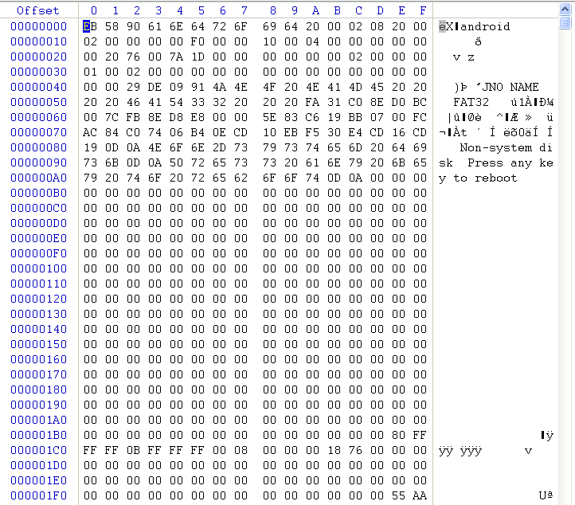

##1 Overview

###1.1 术语

- FAT：File Allocation Table (文件分配表)
- MBR：Master Boot Record (主引导记录)
- DBR：DOS Boot Record (DOS引导记录，位于分区引导扇区)
- DPT：Disk Partition Table (磁盘分区表)
- BPB：BIOS Parameter Block (BIOS 参数块)
- Sector：扇区
- Cluster：簇

分区也称逻辑盘

###1.2 FAT概述及分类

###1.3 FAT文件系统结构

###1.4 FAT分区磁盘组织

4个分区的硬盘结构示意图，其中分为3个基本分区和一个扩展分区。

##2 主引导记录（MBR）

###2.1 组成

MBR + DPT + 0x55AA

###2.2 位置

- 从 0x00 - 0x162 ：这是 MBR 的主体代码区域
- 从 0x162 - 0x1BD：这是 MBR 用到的数据区域
- 从 0x1BE - 0x1FD: 这是 MBR 的磁盘分区表区域. 其中又可分为4个分区表：

		第一个分区表：0x1BE ~ 0x1CD		
		第二个分区表：0x1CE ~ 0x1DD		
		第三个分区表：0x1DE ~ 0x1ED		
		第四个分区表：0x1EE ~ 0x1FD

- 从 0x1FE - 0x1FF：这是 MBR 的标志 "55AA"

###2.3 MBR部分内容

###2.4 DPT详细

DPT组成：

分区标志：

###2.5 MBR标志

0x55AA

###2.6 示例分析

SD卡有MBR吗？如何有，数据怎样？

SD卡MBR信息：

SD卡的DPT:

如何获知实际分区数目？

MBR和DBR如何区分？

##3 具体FAT文件系统分区

### 3.1 组成

	DBR
	Reserve sectors
	FAT1/2
	Data/FDT

基中Reserve sectors数目，FAT大小、FDT的位置在FAT32下可从DBR的BPB参数块获取

### 3.1- DBR

也常常称为启动扇区，Microsoft称它为0扇区（0th sector），通过前面的介绍我们知道，称它为0扇区其实是不正确的，这样容易让人误解它为磁盘的最前面一个扇区，称它为0扇区只是表明它是FAT中扇区的参考点而已

###3.1 DBR组成

##4 Distinguish DBR and MBR 

要读写SD卡（FAT32文件系统），有的SD卡的0扇区是MBR,有的是DBR

那应如何进行识别MBR还是DBR。

###4.1 Linux/android对有无MBR的现象

- 第0扇区是MBR的SD卡，在/dev/目录下会生成两个设备文件，

	/dev/block/mmcblk1 	,整个磁盘
	/dev/block/mmcblk1p1 ,第一个分区 mount -t vfat /dev/block/mmcblk1p1 /xxx 就可以挂载磁盘。 

- 第0扇区是DBR的SD卡，在/dev 目录下只生成一个设备文件

	/dev/block/mmcblk1 ，这时 mount -t vfat /dev/block/mmcblk1b /xxx 可以挂载。

那么linux对它们的识别部分代码应该在哪里呢？ 

###4.2 linux对它们的识别部分代码

部分代码在文件系统层完成，是由block层调用文件系统实现的。fs/check.c,check_partition函数调用msdos_partition（或者其他）函数。

## Reference

[FAT文件系统学习](http://bbs.ednchina.com/BLOG_ARTICLE_904164.HTM)

[FAT32文件系统存储结构](http://wenku.baidu.com/view/435a916e7e21af45b307a821.html)